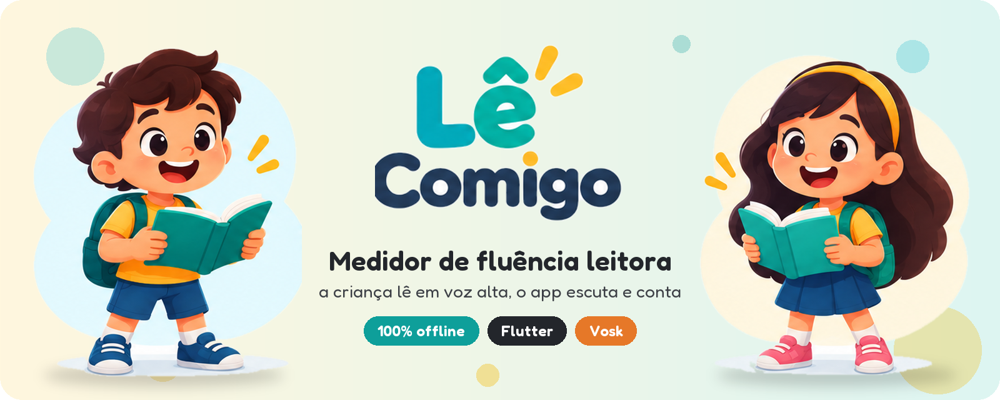
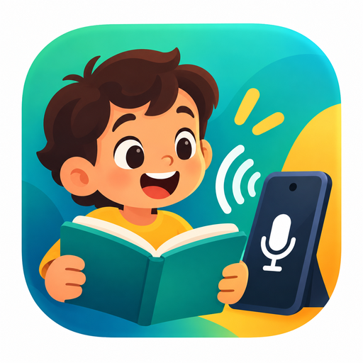

<div align="center">



<br>


**A criança lê um texto em voz alta. O app escuta, acompanha cada palavra e,<br>
no fim, mostra quantas palavras corretas ela leu por minuto.**

Sem internet, sem conta e sem gravar áudio.

</div>

---

## ✨ Por que existe

Medir fluência leitora em sala de aula é trabalhoso: o professor precisa ouvir
cada aluno, cronometrar e contar os erros à mão. O **Lê Comigo** faz essa
contagem no próprio celular ou tablet. O professor escolhe o texto, entrega o
aparelho à criança e recebe o resultado pronto.

<div align="center">

</div>

## 📖 Como funciona

| | Etapa | O que acontece |
|:-:|---|---|
| 📚 | **Biblioteca** | O professor escolhe o ano escolar (1º ao 5º) e um dos textos do ano. |
| 🧒 | **Personagem** | A criança escolhe quem vai ler com ela: o menino ou a menina. |
| ⏱️ | **3, 2, 1…** | Uma contagem regressiva prepara a leitura. |
| 🎙️ | **Leitura** | Enquanto a criança lê, as palavras já lidas são destacadas ao vivo. |
| ⭐ | **Fim** | A criança vê de 0 a 3 estrelas, conforme a precisão da leitura. |
| 📊 | **Detalhes** | O professor vê a PCPM, a precisão, o tempo e o texto com cada palavra marcada. |

### O que é medido

- **PCPM** (palavras corretas por minuto): a métrica clássica de fluência.
- **Precisão**: palavras certas ÷ palavras que a criança tentou ler.
- Cada palavra do texto é marcada como **certa**, **trocada** (a criança leu
  outra coisa), **pulada** (faltou no meio do trecho) ou **não lida** (depois
  do ponto onde a criança parou, o que não conta como erro).

## 🔒 Privacidade em primeiro lugar

- O reconhecimento de voz roda **no aparelho**, com o
  [Vosk](https://alphacephei.com/vosk/) e um modelo em português embutido no app.
- O áudio vai do microfone direto para o reconhecedor, **em memória**. Nada é
  gravado em disco, e nada sai do aparelho.
- O reconhecedor recebe só as palavras do texto escolhido (uma *grammar* do
  Vosk), o que deixa o reconhecimento mais preciso e mais leve.

## 🧱 Arquitetura

```
lib/
├── core/        # Regras em Dart puro, sem Flutter: normalização, alinhamento, métricas
├── data/        # Biblioteca de textos (15 textos originais, 3 por ano)
├── services/    # Vosk (reconhecimento de voz) e efeitos sonoros
├── screens/     # Splash, biblioteca, leitura e resultado
├── widgets/     # Mascote, balão de fala, botão 3D
└── tema/        # Cores, estilos e tema (fonte Fredoka)
```

A tela de leitura segue um fluxo simples, controlado pelo `LeituraController`:

```
escolha do personagem → pronto → contagem 3-2-1 → lendo → fim
```

A avaliação compara as palavras esperadas com as reconhecidas, sem acentos e
sem pontuação, e classifica cada palavra do texto. Por isso as regras de
`lib/core` são testadas sem precisar de aparelho.

## 🚀 Rodando o projeto

**Requisitos:** Flutter 3.x (Dart 3) e um aparelho ou emulador Android com microfone.

```bash
git clone https://github.com/marcelonvg/LeComigo.git
cd LeComigo
flutter pub get
flutter run
```

Na primeira abertura, o app descompacta o modelo de voz (~31 MB), o que leva
alguns segundos.

### Testes

```bash
flutter test
```

Os testes também garantem as regras da biblioteca: toda palavra dos textos
existe no vocabulário do modelo Vosk, os ids são únicos, há 3 textos por ano e
cada texto tem o tamanho certo para o seu ano.

## 🗺️ Próximos passos

- [ ] 🌎 Português, inglês e espanhol, com o idioma escolhido na primeira abertura
- [ ] 🗂️ Histórico de leituras por aluno
- [ ] 📄 Relatório em PDF para o professor

## 🎨 Créditos

| Recurso | Origem | Licença |
|---|---|---|
| Reconhecimento de voz | [Vosk](https://github.com/alphacep/vosk-api) · `vosk-model-small-pt-0.3` | Apache 2.0 |
| Fonte | [Fredoka](https://fonts.google.com/specimen/Fredoka) | SIL OFL ([assets/fonts/OFL.txt](assets/fonts/OFL.txt)) |
| Efeitos sonoros | [Kenney](https://www.kenney.nl) | CC0 ([assets/sons/LICENCA.txt](assets/sons/LICENCA.txt)) |
| Personagens e ilustrações | Arte do projeto Lê Comigo | — |

<div align="center">
<br>


Feito com 💛 para quem está aprendendo a ler.

</div>
